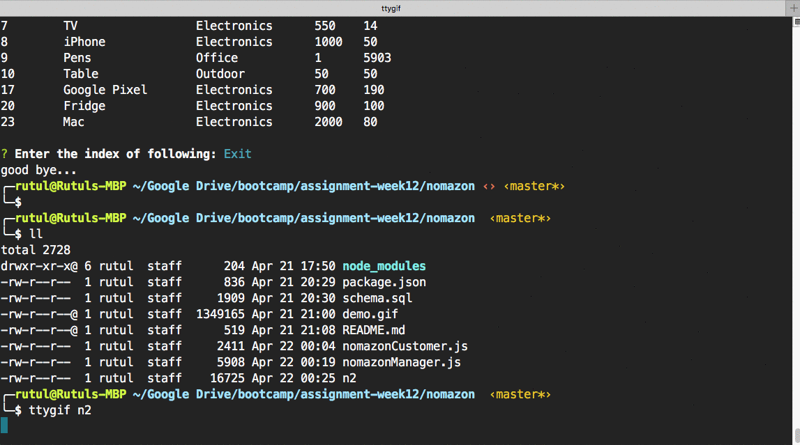

# nomazon
An amazon like simple online store application made in nodejs which can be accessed through cli.

## Description
A basic shopping application just like amazon in nodejs in CLI which updates the database based on items purchased and alerts customer if the stock quamtity is lesser than order quantity. This application interacts with local MySQL database, which stores products data in one simple table. 

Nomazon also have manager view feature, with that managers can do the following. Checkout demo gifs of customer and manager view of the application below.
- View Products for Sale
- View Low Inventory
- Add to Inventory
- Add New Product

## Technologies Used
- NodeJS
- NPM (mysql, inquirer, conosole.table)
- MySQL

## nomazonCustomer.js DEMO

## nomazonManager.js DEMO
